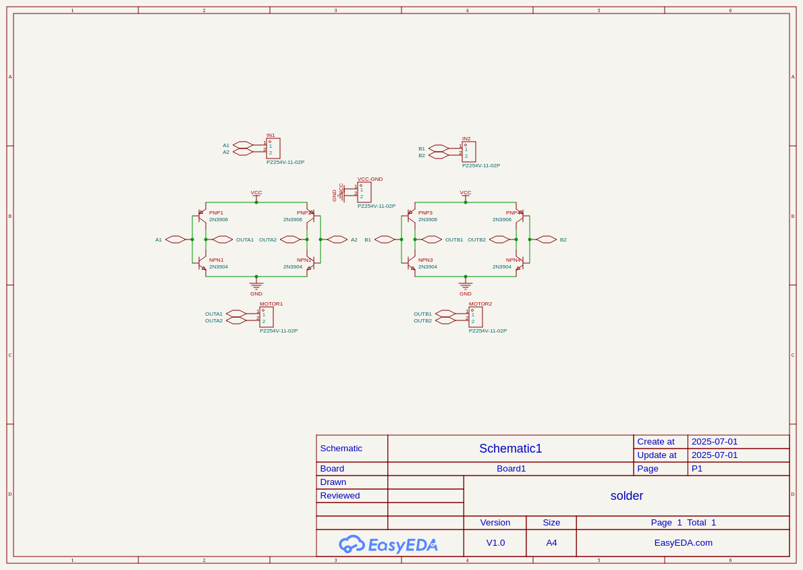
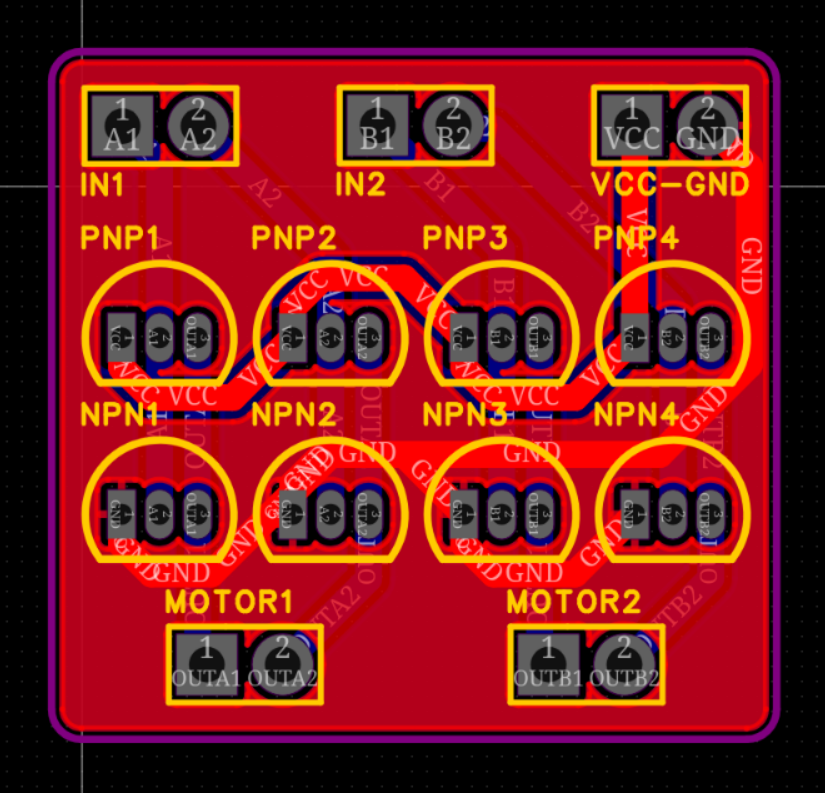
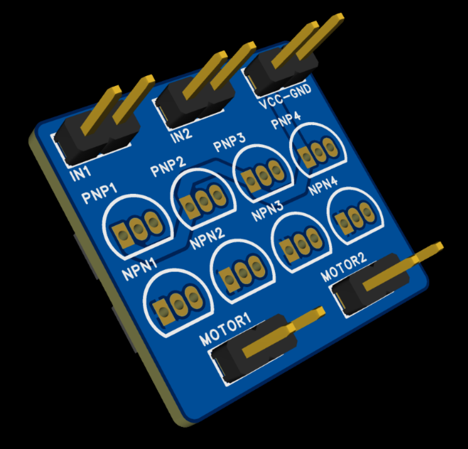

# dual-h-bridge
## Two H-bridges made out of pure transistors, on one small PCB.

This board can run up to two motors. Ideally it would also have protection diodes, but they don't come in the solder kit.

### Schematic:

### PCB (headers won't actually be placed):

